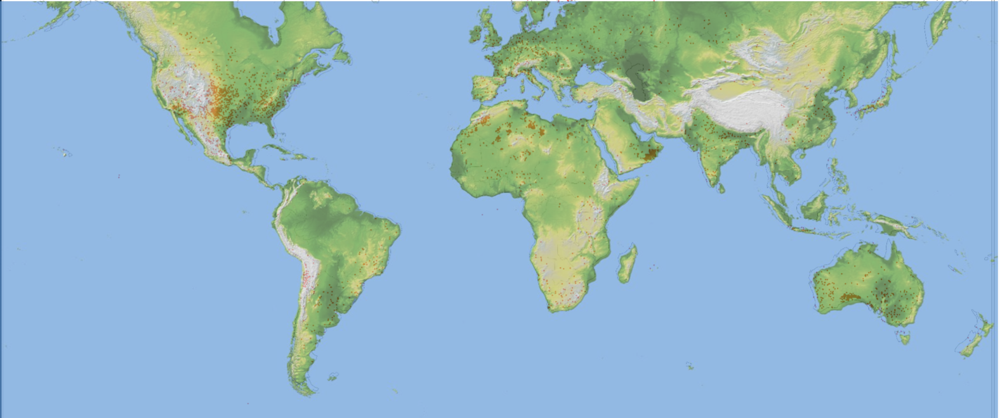

# Team 9: Study of geographic hotspots for meteorite falls and mass variations
## ECE 143 Final Project

## Team 9 Members
    Aleksandar Jeremic
    Geetika Agrawal
    Zhongqi Wu
    Yiwei Zhang
    Tony Guan

## Introduction

Figure. A topological map overlaid on top of scatter plot of the meteorites (the darker the color the lower the height in sea level).

## Dataset 
    Meteorite_Landings.csv

## File Structure 
    ├─ Root
        ├─ README.md
        ├─ Data_set	   
            ├─ Meteorite_Landings.csv
            ├─ Continents.csv
        ├─ Code
            ├─ meteorite_project.ipynb
            ├─ meteorite_project.py
        ├─ Slides
            ├─ ECE 143 Team 9 Presentation.pdf
        ├─ Fig    
            ├─ world_map.png

## Third Party Modules
    Numpy
    Pandas
    Matplolib
    Seaborn
    Cartopy

## Presentation Link

https://docs.google.com/presentation/d/1M_xisTddD40RtB-TG1Whck82eeoZnFnuX2P7t-EBaPg/edit?usp=sharing

